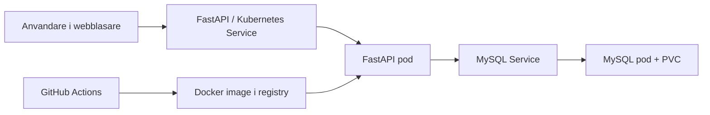

# Rapportmall: CI mot Kubernetes-kluster

## 1. Inledning

Detta projekt ar en enkel cloud native-applikation som uppfyller G-kraven i uppgiften. Losningen bestar av en webbtjanst skriven i Python med FastAPI, en MySQL-databas och en CI-pipeline i GitHub Actions. Applikationen ar deployad till ett Kubernetes-kluster med manuella `kubectl`-kommandon.

Syftet med applikationen ar att erbjuda ett enkelt spel, sten-sax-pase, dar varje spelomgang sparas i databasen. Applikationen kan ocksa visa statistik over antal spel, antal vinster, antal forluster och vinstprocent.

## 2. Arkitektur

Systemet bestar av tre huvuddelar:

- en FastAPI-baserad webbtjanst
- en MySQL-databas
- en CI-pipeline i GitHub Actions

Nar anvandaren spelar en omgang skickas ett HTTP-anrop till API:et. API:et skapar datorns val, raknar ut resultatet och sparar omgangen i databasen. Statistik hamtas genom att API:et raknar pa sparade rader i databasen.



Forslag pa bilder att lagga till i den slutliga inlamningen:

- skarmbild pa GitHub Actions-korning
- skarmbild pa pods och services i Kubernetes
- skarmbild pa applikationen i webblasaren

## 3. CI-flode

Projektet anvander GitHub Actions som CI-losning. Nar kod pushas till repot eller nar en pull request skapas sker foljande:

1. koden checkas ut
2. Python installeras
3. beroenden installeras
4. enhetstester kors med `pytest`
5. Docker-image byggs
6. imagen pushas till Docker Hub om nodvandiga secrets och variables ar konfigurerade

Fordelen med detta flode ar att fel upptacks tidigt. Om testerna inte gar igenom stoppas pipelinen innan en ny image publiceras.

## 4. Kubernetes-losning

Losningen kor i ett eget namespace i Kubernetes. Databasen kor som en separat deployment med en persistent volume claim for att inte forlora data mellan omstarter. Applikationen kor som en egen deployment och ansluter till databasen via en intern service.

Applikationen deployas manuellt med `kubectl apply -f`. Det gor att losningen uppfyller kravet pa manuell deploy, samtidigt som CI-delen fortfarande automatiserar test, build och publish till registry.

Exempel pa deploy-steg:

```bash
kubectl apply -f k8s/namespace.yaml
kubectl apply -f k8s/mysql-secret.yaml
kubectl apply -f k8s/mysql-pvc.yaml
kubectl apply -f k8s/mysql.yaml
kubectl apply -f k8s/app.yaml
```

## 5. Motivering av teknikval

Jag valde Python och FastAPI eftersom det ar snabbt att utveckla i, enkelt att testa och ger tydliga API-endpoints. MySQL valdes eftersom uppgiften uttryckligen foreslar en databastjanst i klustret. Docker anvands for att paketera applikationen och gora den enkel att kora likadant lokalt och i Kubernetes.

GitHub Actions valdes som CI-plattform eftersom GitHub ar en vanlig cloud-baserad kallkodsleverantor och har fardigt stod for arbetsfloden som behovs i uppgiften.

## 6. Resultat och vidareutveckling

Projektet uppfyller G-kraven genom att:

- ha kallkod i ett git-repo
- kora enhetstester i CI
- bygga och kunna pusha container image till registry
- anvanda en databasdriven webbtjanst
- deployas till ett Kubernetes-kluster med manuella `kubectl`-kommandon

Om projektet skulle vidareutvecklas skulle nasta steg kunna vara:

- ingress for extern exponering
- Helm-chart for enklare paketering
- separata miljoer for test och produktion
- fler tester, till exempel integrationstester mot MySQL
