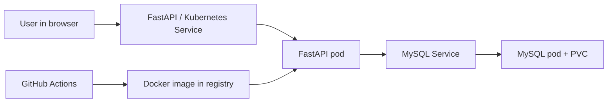

# Report Template: CI to Kubernetes Cluster

## 1. Introduction

This project is a small cloud native application that meets the course requirements. The solution consists of a web service written in Python with FastAPI, a MySQL database, and a CI pipeline in GitHub Actions. The application is deployed to a Kubernetes cluster with manual `kubectl` commands.

The purpose of the application is to provide a simple Rock, Paper, Scissors game where every game round is stored in the database. The application can also display statistics for total games, wins, losses, draws, and win rate.

## 2. Architecture

The system consists of three main parts:

- a FastAPI-based web service
- a MySQL database
- a CI pipeline in GitHub Actions

When the user plays a round, the browser sends an HTTP request to the API. The API creates the computer choice, calculates the result, and stores the round in the database. Statistics are returned by counting the stored database rows.



Suggested screenshots to add before final submission:

- screenshot of the GitHub Actions run
- screenshot of pods and services in Kubernetes
- screenshot of the application in the browser

## 3. CI Flow

The project uses GitHub Actions as the CI solution. When code is pushed to the repository or when a pull request is created, the workflow does the following:

1. checks out the code
2. installs Python
3. installs dependencies
4. compiles the Python code
5. runs unit tests with `pytest`
6. builds a Docker image
7. pushes the image to Docker Hub when the required secrets are configured

The advantage of this flow is that errors are detected early. If the tests fail, the pipeline stops before a new image is published.

## 4. Kubernetes Solution

The solution runs in its own namespace in Kubernetes. The database runs as a separate deployment with a persistent volume claim so data is not lost between restarts. The application runs as its own deployment and connects to the database through an internal service.

The application is deployed manually with `kubectl apply -f`. This satisfies the manual deployment requirement while CI still automates testing, building, and publishing the image to the registry.

Example deployment steps:

```bash
kubectl apply -f k8s/namespace.yaml
kubectl apply -f k8s/mysql-secret.yaml
kubectl apply -f k8s/mysql-pvc.yaml
kubectl apply -f k8s/mysql.yaml
kubectl apply -f k8s/app.yaml
```

## 5. Technology Choices

I chose Python and FastAPI because they are quick to develop with, easy to test, and provide clear API endpoints. MySQL was chosen because the assignment suggests a database service running in the cluster. Docker is used to package the application so it can run the same way locally and in Kubernetes.

GitHub Actions was chosen as the CI platform because GitHub is a common cloud-based source code provider and has built-in support for the workflow required by the assignment.

## 6. Result and Future Improvements

The project meets the requirements by:

- storing source code in a Git repository
- running unit tests in CI
- building and pushing a container image to a registry
- using a database-driven web service
- deploying to a Kubernetes cluster with manual `kubectl` commands

Possible future improvements:

- add ingress for external access
- add a Helm chart for easier packaging
- add separate environments for test and production
- add more tests, such as integration tests against MySQL
