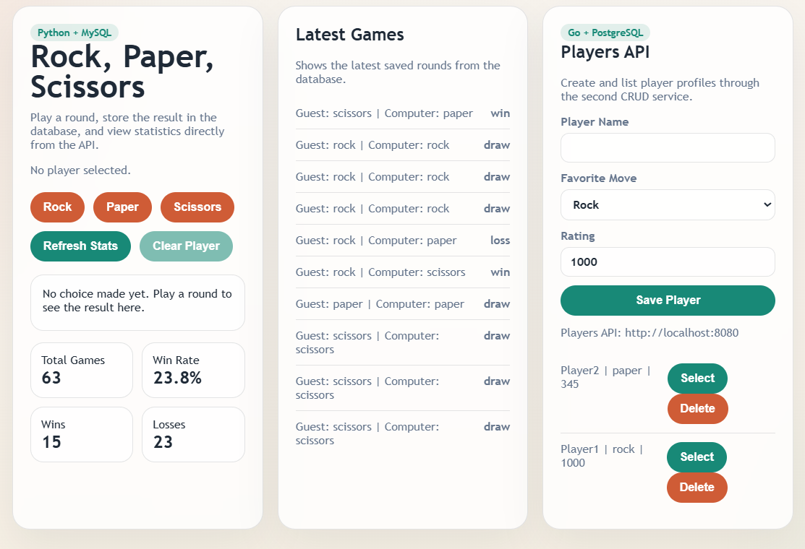
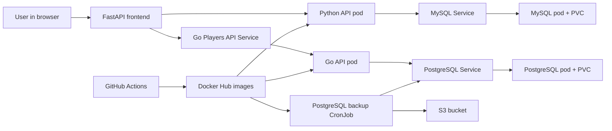

# CI to Kubernetes Cluster

## 1. Introduction

This project is a cloud native application that meets both the G and VG requirements. The solution consists of a Python FastAPI service, a Go CRUD service, a frontend, two databases, CI in GitHub Actions, Docker images in Docker Hub, manual Kubernetes deployment, and PostgreSQL backups to S3.

The Python service provides a Rock, Paper, Scissors game. Each game round is stored in MySQL and the API returns total statistics such as total games and win rate.

The Go service provides an additional CRUD API for player profiles. Player data is stored in PostgreSQL, which is a different database from the MySQL database used by the Python service.

## 2. Architecture

The system consists of these main parts:

- FastAPI web service and frontend
- Go Players CRUD API
- MySQL database for game rounds
- PostgreSQL database for player profiles
- PostgreSQL backup CronJob that uploads dumps to S3
- CI pipeline in GitHub Actions

The browser loads the frontend from the Python service. The frontend calls the Python API for game rounds and statistics, and it calls the Go API for player profile CRUD operations.





## 3. CI Flow

The project uses GitHub Actions as the CI solution. When code is pushed to the repository or when a pull request is created, the workflow does the following:

1. checks out the code
2. installs Python and Go
3. installs dependencies
4. compiles Python and Go code
5. runs Python tests with `pytest`
6. runs Go tests with `go test ./...`
7. builds Docker images for the Python API, Go API, and PostgreSQL backup job
8. pushes the images to Docker Hub on pushes to `main` or `master`

The advantage of this flow is that errors are detected early. If compilation or tests fail, the pipeline stops before new images are published.

## 4. Kubernetes Solution

The solution runs in its own `rps` namespace in Kubernetes. MySQL and PostgreSQL run as separate deployments with persistent volume claims, so data is preserved between pod restarts. Each API runs as its own deployment and connects to its database through an internal Kubernetes service.

The application is deployed manually with `kubectl apply -f`. This satisfies the manual deployment requirement while CI still automates test, build, and image publishing.

Example deployment steps:

```bash
kubectl apply -f k8s/namespace.yaml
kubectl apply -f k8s/mysql-secret.yaml
kubectl apply -f k8s/mysql-pvc.yaml
kubectl apply -f k8s/mysql.yaml
kubectl apply -f k8s/app.yaml
kubectl apply -f k8s/postgres-secret.yaml
kubectl apply -f k8s/postgres-pvc.yaml
kubectl apply -f k8s/postgres.yaml
kubectl apply -f k8s/players-api.yaml
```

The services can be reached locally with port-forwarding:

```bash
kubectl -n rps port-forward svc/rps-api 8000:8000
kubectl -n rps port-forward svc/players-api 8080:8080
```

## 5. S3 Backup

The PostgreSQL database is backed up with a Kubernetes CronJob. The backup image contains `pg_dump` and the AWS CLI. The CronJob creates a compressed SQL dump and uploads it to an S3 bucket.

The S3 credentials and bucket name are provided through a Kubernetes secret named `s3-backup-secret`. A sample manifest is included in `k8s/s3-secret.example.yaml`, and the README also shows a `kubectl create secret` command.

## 6. Technology Choices

Python and FastAPI were chosen for the game service because they are quick to develop with, easy to test, and provide clear API endpoints. Go was chosen for the second API because the VG requirements ask for an additional service in the other language.

MySQL is used by the Python service, and PostgreSQL is used by the Go service to satisfy the requirement for a different database. Docker packages the services so they run consistently in CI and Kubernetes.

GitHub Actions was chosen as the CI platform because GitHub is a common cloud-based source code provider and has built-in support for the workflow required by the assignment.

## 7. Result and Future Improvements

The project meets the requirements by:

- storing source code in a Git repository
- running compilation and tests in CI
- building and pushing Docker images to Docker Hub
- using a Python service with MySQL
- using a Go CRUD service with PostgreSQL
- providing browsable API documentation for the Go service
- including a frontend that consumes both APIs
- deploying to Kubernetes with manual `kubectl` commands
- setting up PostgreSQL backups to S3

Possible future improvements:

- add ingress for external access
- add a Helm chart for easier packaging
- add separate environments for test and production
- add integration tests against MySQL and PostgreSQL
